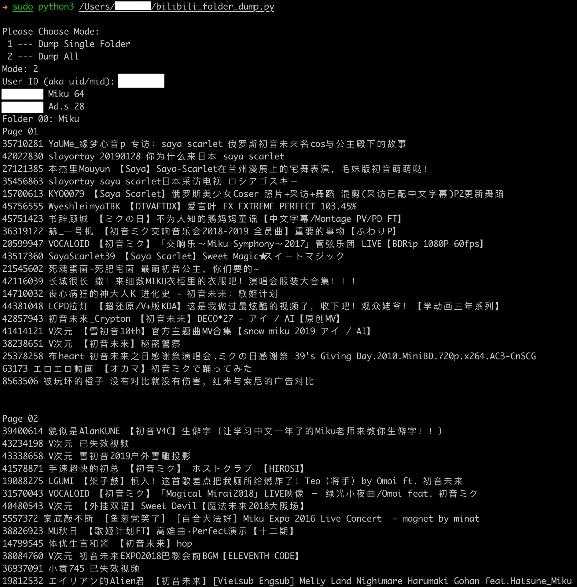

# Bilibili Folder Dump

## Feature
- Crawl Bilibili Public Folders
- Crawl all the public folders or the specific one (Public Only)
- Sort downloads by uploder name automatically

## Requirement
- Python3
- annie
- FFmpeg & Bash (only for additional Shell script)

### How to Install
#### Python3
- macOS: 
	- Native built-in, no need for downloading
	- Or use `brew install python3` to install the non-native Python3
- Windows: 
	- Download Python3 manually from <https://www.python.org/downloads/windows/>
- Linux:
	- Use the package manager
		- e.g. 
			- Debian: `apt install python3`
			- SUSE: `zypper install python3`

#### [annie](https://github.com/iawia002/annie)
- macOS:
	- Run the command `brew install annie` in Teriminal
- Windows: 
	- Run the command `scoop install annie`
- Linux: 	
	- Refer to <https://github.com/iawia002/annie>

## Usage
1. Open up any terminal app (e.g. macOS - Teriminal.app, Windows - CMD and etc.) and input command `python3 [SCRIPT_PATH]`

2. When `Please Choose Mode:` displayed 
	- Input `1`: Dump Single Folder (fid will be required)
		- It will download all of the videos in the chosen folder. 
	- Input `2`: Dump All (uid/mid will be required)
		- It will download the videos in every folder which is public by the target user. 

3. When `Cookies Path (0 for not required): ` displayed 
	- Please input the path to load the Cookies (for hi-definition version videos' requirement).

4. When `Output Path: ` displayed 
	- Please input the path where you want to save the vidoes.
		- path without any special character is recommended
		- e.g. `~/[$YOUR_DIRNAME]`
	- If the `path` doesn't exist, it will be made up automatically, or it will just use the exist one.
	- If you choose a `path` where there has already been some earlier image downloads by this script or not, the images will still be downloaded and replaced (if they share the same name).

5. When `User ID (aka uid/mid): ` or `Medialist ID (aka fid): ` displayed  
	- Please input the uid/mid or fid (depend on the mode you chosen)

## *Additonal
> Not included in the Python script

- Shell script `flv2mp4.sh` can be used for re-encapsulating videos in the current directory and all the sub-directories. (**Bash** and **FFmpeg** required)

- Usage:
	1. `cd` to the target directory in Terminal
	2. `sh [$shell_script_path]`
	3. When `Keep original flv files? (Y/N) ` displayed
		- Input `Y` or `y` if you want to keep the origianl flv files 

## Demo

