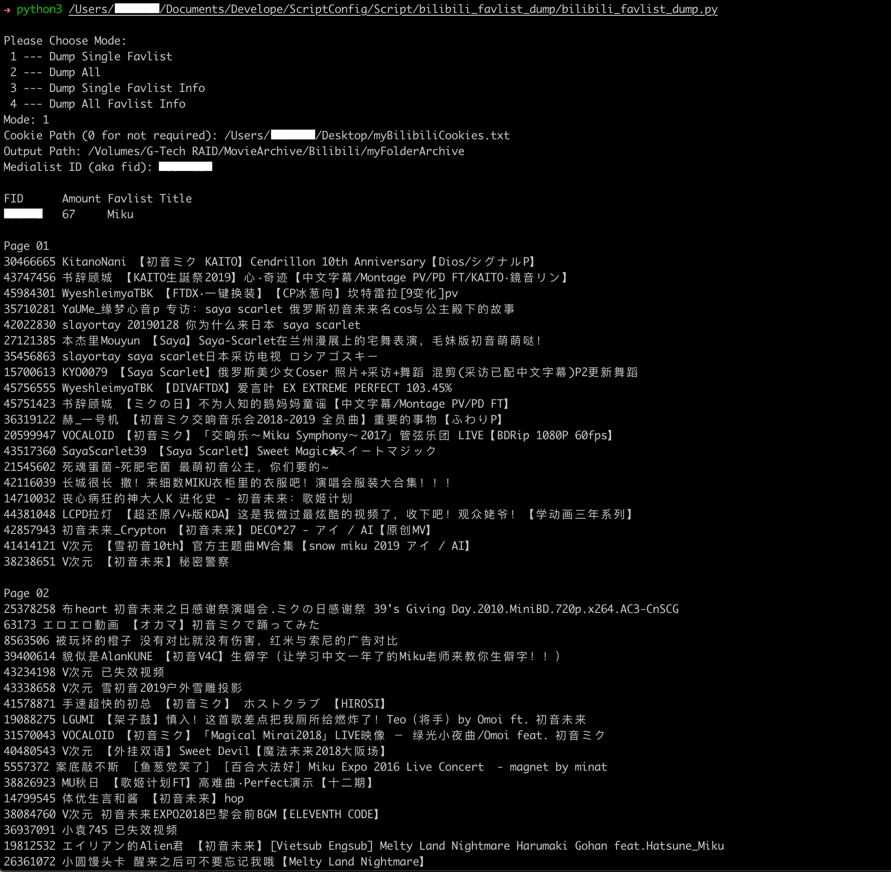
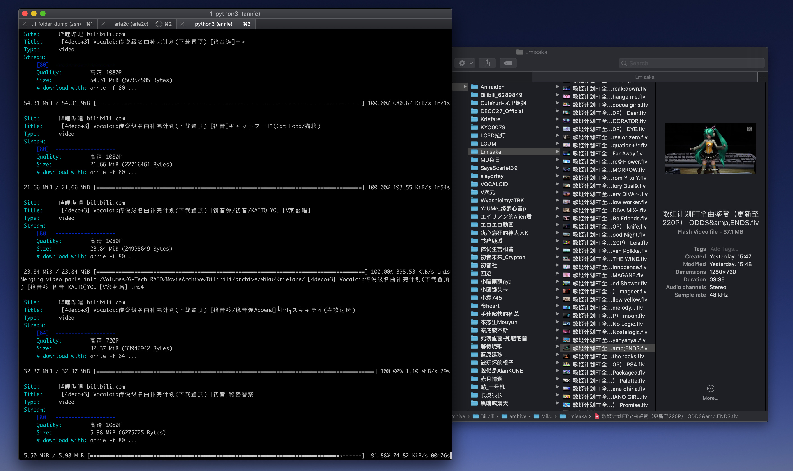
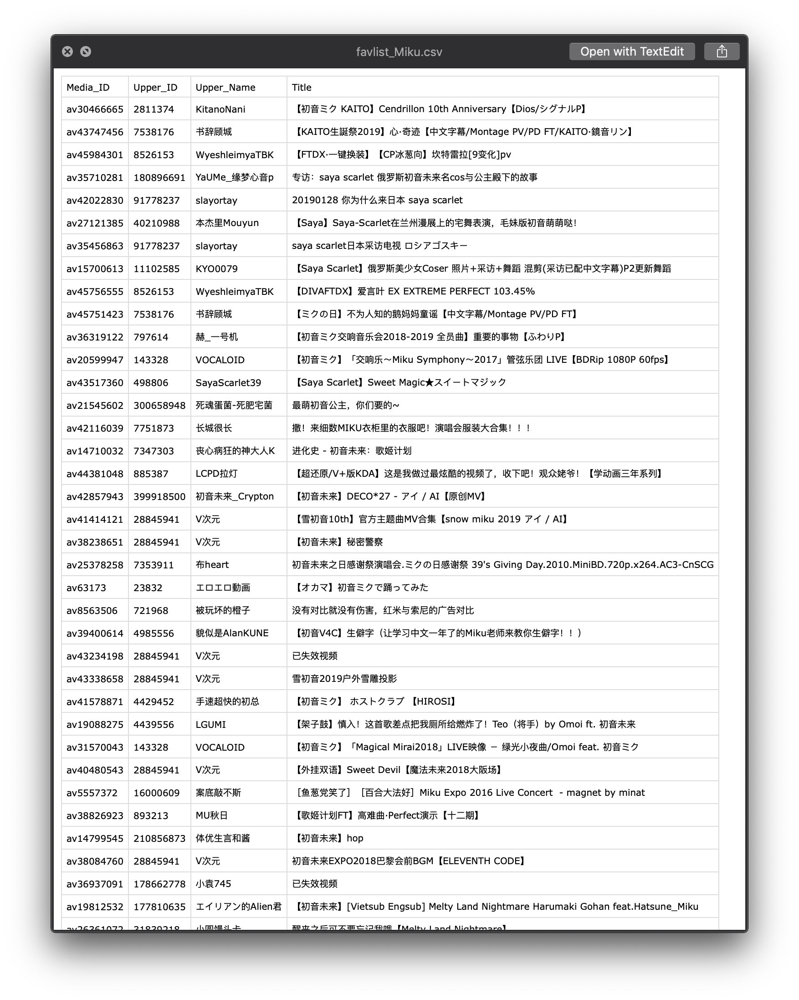

# Bilibili Favlist Dump

## Feature
- Crawl Bilibili Public Favlist
- Crawl all the public Favlist of one user or the specific one (**Public Only**)
- **Auto-sort** downloads by uploder name automatically
- Auto-build **csv** files for each Favlist

## Requirement
- Python3
- annie
- FFmpeg & Bash (only for additional Shell script)

### How to Install
#### Python3
- macOS: 
	- Native built-in, no need for downloading
	- Or use `brew install python3` to install the non-native Python3
- Windows: 
	- Download Python3 manually from <https://www.python.org/downloads/windows/>
- Linux:
	- Use the package manager
		- e.g. 
			- Debian: `apt install python3`
			- SUSE: `zypper install python3`

#### [annie](https://github.com/iawia002/annie)
- macOS:
	- Run the command `brew install annie` in Teriminal
- Windows: 
	- Run the command `scoop install annie`
- Linux: 	
	- Refer to <https://github.com/iawia002/annie>

## Usage
1. Open up any terminal app (e.g. macOS - Teriminal.app, Windows - CMD and etc.) and input command `python3 [SCRIPT_PATH]`

2. When `Please Choose Mode:` displayed 

	- Input `1`: Dump Single Favlist (`fid` required)
		- It will dump all the info and videos of the chosen Favlist. 
	- Input `2`: Dump All Favlists (`uid/mid` required)
		- It will dump the info and videos in every Favlist, which is set Public by the user. 
	- Input `3`: Dump Single Favlist (Info Only) (`fid` required)
		- It will dump the info of of the chosen Favlist. 
	- Input `4`: Dump All Favlists (Info Only) (`uid/mid` required)
		- It will dump the info in every Favlist, which is set Public by the user. 

3. When `Cookies Path (0 for not required): ` displayed 
	- Please input the path to load the Cookies (for hi-definition version videos' requirement).

4. When `Output Path: ` displayed 
	- Please input the path where you want to save the vidoes.
		- path without any special character is recommended
		- e.g. `~/[$YOUR_DIRNAME]`
	- If the `path` doesn't exist, it will be made up automatically, or it will just use the exist one.
	- If you choose a `path` where there has already been some dumped files by this script, the videos won't be re-dumped as long as they shared the same filename.
	- re-dump check **mostly** works (The rest of the checking task can be perfectly handled by `annie` itself)

5. When `User ID (aka uid/mid): ` or `Medialist ID (aka fid): ` displayed  
	- Please input the uid/mid or fid (depend on the mode you chosen)

## Reference of CSV
- Any Mode option will build a csv file automatically which inludes the elements below
	- `Media_ID`: The ID of the video in Bilibili, e.g. av3046665
	- `Media_Title`: The video's title in Bilibili
	- `Upper_ID`: The ID of the video uploader in Bilibili, e.g. 2811374
	- `Upper_Name`: The name of the video uploader in Bilibili
	- `Media_Amount`: The sum of the videos in the Favlist (One `Media_ID` may contain multiple videos)
	- `Valid_Amount`: The sum of the videos, which is not invalid, in the Favlist
	
## *Additonal
> Not included in the Python script

- Shell script `flv2mp4.sh` can be used for re-encapsulating videos in the current directory and all the sub-directories. (**Bash** and **FFmpeg** required)

- Usage:
	1. `cd` to the target directory in Terminal
	2. `bash [$shell_script_path]`
	3. When `Keep original flv files? (Y/N) ` displayed
		- Input `Y` or `y` if you want to keep the origianl flv files 

## Demo

 